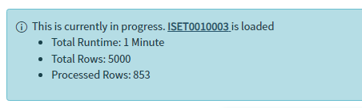
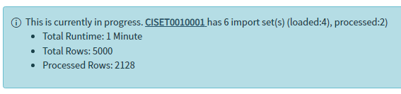
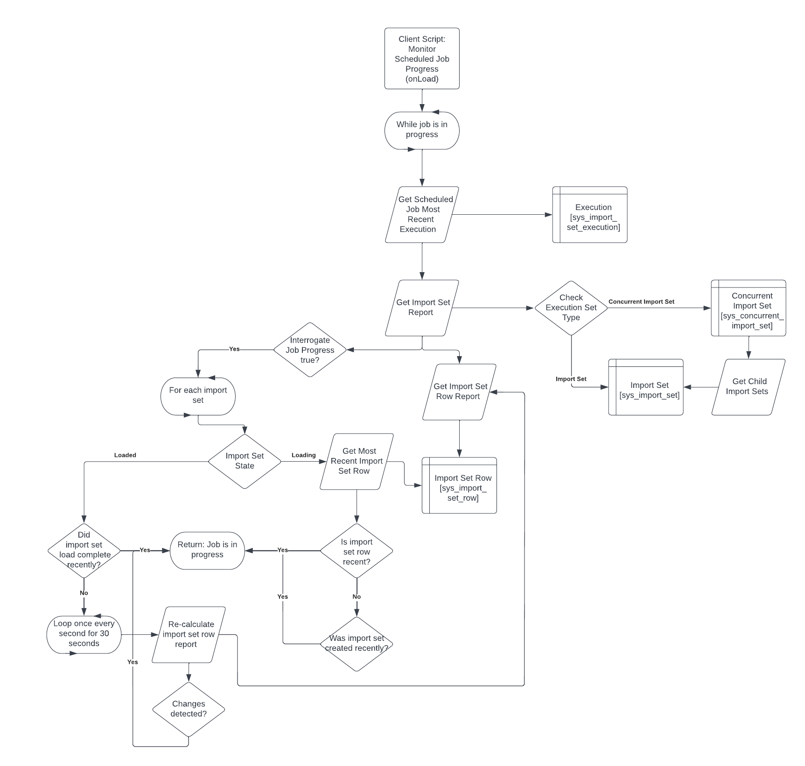

# Scheduled Job Utilities

A scoped application that contains utility scripts that will let you know if a scheduled data import is ACTUALLY in progress and lets you know the progress the scheduled job is currently at.

One big issue that I run into when dealing with integrations (especially in a customer ServiceNow environment)  is to know if the scheduled data import jobs are actually in progress. Sometimes jobs will complete in an error state or just stay stuck in a "loading" state. And even right after executing a scheduled job the inevitable "how do we know how far along it is" always comes up. 
Sure there are plenty of ways to see this, you can monitor the staging tables to see rows stream in, or you can view the transform history table to get a better understanding of the overall processing rate or everyone's nightmare, the system logs. 
The problem is that you just have to know where everything is, and it takes more than just a few clicks to get there. I created this app so that when you open a scheduled data import record, or you just executed one, you get immediate feedback on which import set is executing, what state its in, and how many rows are being processed.

## How to get
You can fork this branch to import it to you sub-prod instance or your PDI.
There is no setup involved with this application since its fairly plug and play. The only set up that is potentially requires is to scope the client script down to just a subset of scheduled jobs.

## Overview
The application is relativity easy to use since it doesn't really require you to do much of anything other than run a scheduled import.

When the 

When you open a scheduled data import, the Monitor Scheduled Job Progress client script will run a background check to see the state of the execution for either of the current scheduled job or a related one based on the execution context. 

If a scheduled job is running a concurrent import, the application is able to summarize the entire concurrent import and still give you a comprehensive report of the current status.

**Progress Check Flow Diagram**

By default the interrogate_scheduled_job_progress system property is set to false meaning the queries are relatively simple only checking the states of any related import sets and the overall import set row progress related to the scheduled job. It wont do anything further to determine if the scheduled job could potentially be hanging in place in a situation where the an import set is stuck in a loading or loaded state with nothing actually happening in the background.

If the interrogate_scheduled_job_progress  system property is set to true, the progress checker will "interrogate" the active import sets to determine whether the import is actually running. This is primarily done by checking the age of the import sets and its child rows to see if there have been any recent changes. As a last ditch effort if there is no activity happening on a loaded import set, the progress checker will take snapshots of the import set rows once every second until change has been seen that verifies the import is still running. After 30 seconds the progress worker will assume the job is stalled.

## Application Files
The Scheduled Job Utilities application is a scoped app so everything should be very contained within the Scheduled Job Utilities [x_156954_sch_util] scope.
### Script includes

 - ImportSetReport
	 - Model script include representing the generated report that determines if a scheduled data import is running and what its status is.
 - ScheduledImportReportController
	 - Controller Script include used to create a report on a scheduled jobs job status in a way that can be displayed to the user on the client side.
 - ScheduledJobAjaxHelper
	 - GlideAjax script include to be called by the Monitor Scheduled Job Progress client script.

### Client Scripts
 - Monitor Scheduled Job Progress
	 - Executes when the form loads to check to see if the most recent execution of the current scheduled job is in progress. If the scheduled job deemed to be in progress, the client script will execute once ever 10 seconds to refresh the progress status.

### Access Controls
 - ScheduledJobAjaxHelper (execute)
	 - Default ACL for the client callable script include. Requires same roles listed for the Scheduled Job READ ACL.
		 - import_scheduler
		 - import_admin

### System Properties
 - x_156954_sch_util.interrogate_scheduled_job_progress
	 - True/False
	 - Roles: admin
	 - When set to True, the scheduled job progress trackers will do additional checks to determine if a scheduled job may be accidentally in a stale state. For example, stuck in a "loading" state but no transforms are actually executing. (Warning: although extremely rare, when this is set to true and a scheduled job is stale, this process can take up to 30 seconds to process in order for the proper checks to take place.)
